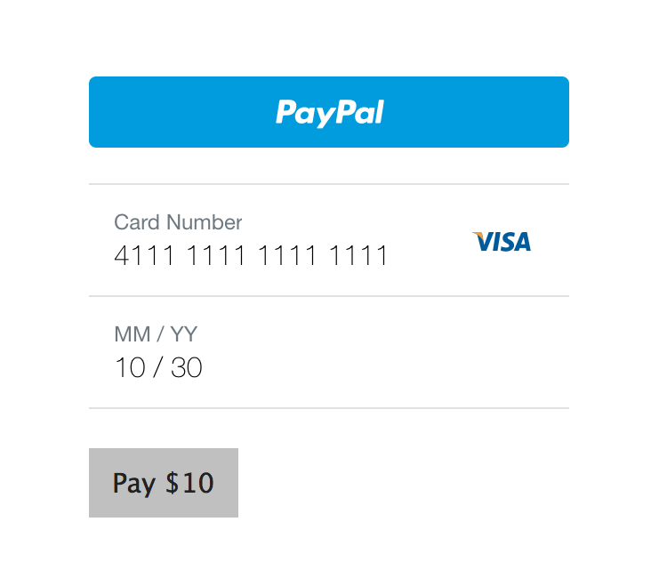
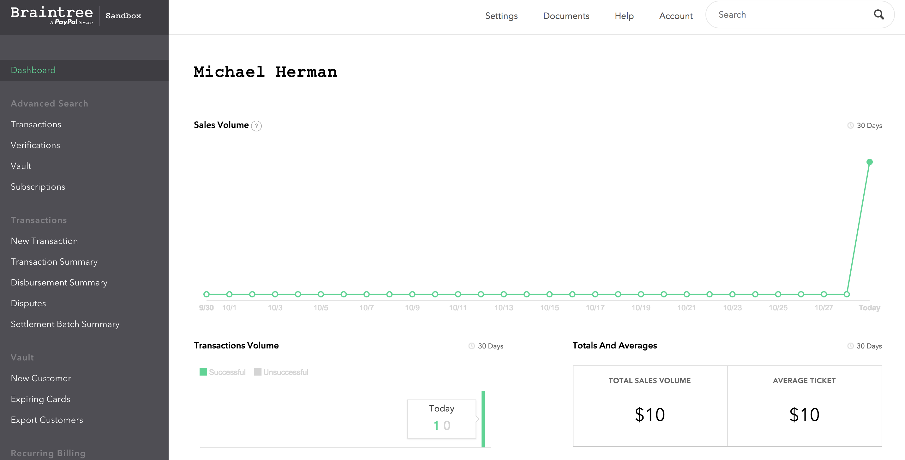

# Braintree Paywall

Payment paywall for Node and Express, for one-time charges

## Getting Started

1. Fork/Clone
1. `npm install`
1. Set up a [Sandbox](https://sandbox.braintreegateway.com)
1. Copy *.env-sample* to *.env* and then update - `cp .env-sample .env`
1. Update transaction amount in *src/server/payment/braintree.js*

## Workflow

1. `npm start`
1. View [http://localhost:3000/](http://localhost:3000/) in your favorite browser
1. Purchase:
  
    

1. View Dashboard:

    

## Test

1. `npm test`
